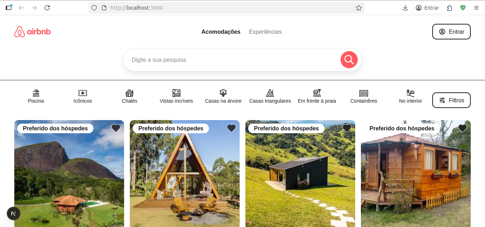
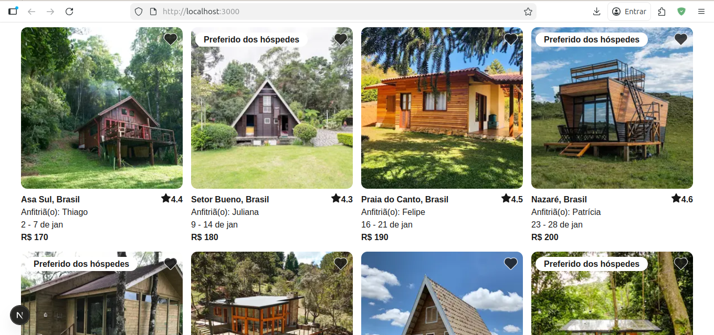

# Airbnb Clone Project

This project is a functional clone of the Airbnb platform, developed for student and educational purposes. It demonstrates a modern web application architecture using the latest technologies.

> [!IMPORTANT]
> This project is non-profit and strictly for educational and student purposes.

## Technologies Used

The project leverages a modern tech stack to ensure performance, type safety, and a premium user experience:

- **Framework**: [Next.js 15](https://nextjs.org/) (App Router)
- **Library**: [React 19](https://react.dev/)
- **Styling**: [Tailwind CSS 4](https://tailwindcss.com/)
- **Language**: [TypeScript](https://www.typescriptlang.org/)
- **Icons**: [Tabler Icons](https://tabler.io/icons)
- **Slider**: [Swiper](https://swiperjs.com/)
- **Formatting**: [Prettier](https://prettier.io/) with Tailwind CSS and Import Sort plugins

## Project Structure

Below is the directory structure (excluding `.github`, `node_modules`, and build artifacts):

```text
.
├── src
│   ├── app
│   │   ├── [id]
│   │   │   └── page.tsx           # Accommodation details page
│   │   ├── favicon.ico
│   │   ├── globals.css           # Global styles
│   │   ├── layout.tsx            # Root layout
│   │   └── page.tsx              # Home / listing page
│   ├── assets
│   │   └── icons.ts              # Custom SVG icon components
│   ├── components
│   │   ├── Accommodation
│   │   ├── IconButton
│   │   └── Logo
│   ├── types
│   │   └── AirbnbData.ts         # TypeScript interfaces
│   ├── utils
│   │   └── api.ts                # API/Fetch utilities
│   └── widgets
│       ├── AccommodationDetails.tsx
│       ├── AccommodationList.tsx
│       ├── AccommodationTestimonials.tsx
│       ├── Footer.tsx
│       ├── Gallery.tsx
│       ├── NavbarFilter.tsx
│       ├── NavbarTop.tsx
│       └── SearchBar.tsx
├── public                        # Static assets
├── next.config.ts                # Next.js configuration
├── tailwind.config.ts            # Tailwind configuration
├── tsconfig.json                 # TypeScript configuration
└── package.json                  # Dependencies and scripts
```

## How to Run

Follow these steps to set up and run the project locally:

### Prerequisites

- Node.js (Latest LTS version recommended)
- npm or yarn

### Installation

1. Clone the repository:

   ```bash
   git clone <repository-url>
   ```

2. Install dependencies:

   ```bash
   npm install
   ```

### Development Server

Run the development server:

```bash
npm run dev
```

Open [http://localhost:3000](http://localhost:3000) with your browser to see the result.

### Build and Start

To build and run the production version:

```bash
npm run build
npm start
```

## Previews



